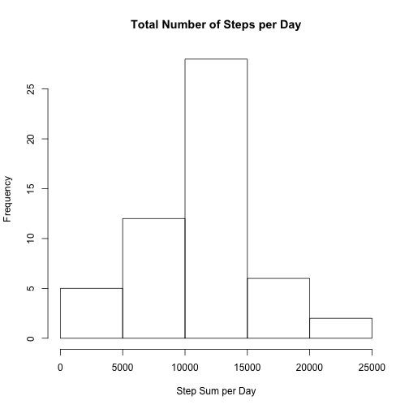
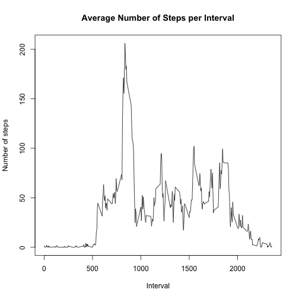
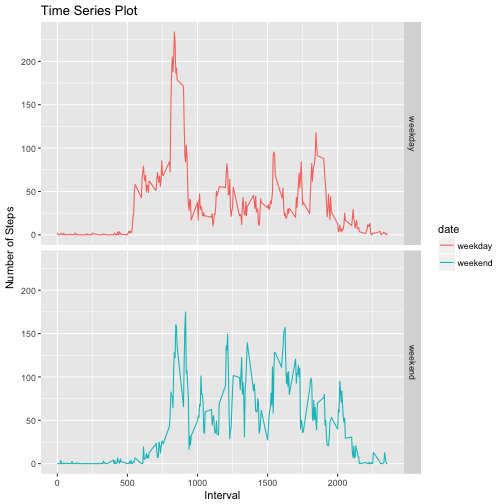

```r
---
title: "Week2_Assignment"
output: html_document
---

This assignment makes use of data from a personal activity monitoring device. This device collects data at 5 minute intervals through out the day. The data consists of two months of data from an anonymous individual collected during the months of October and November, 2012 and include the number of steps taken in 5 minute intervals each day.
The data for this assignment can be downloaded from the course web site:
Dataset: Activity monitoring data [52K]
First we need to read the data set into Rstudio and download neccessary R packages
```

```
## Error: <text>:6:6: unexpected symbol
## 5: 
## 6: This assignment
##         ^
```

```r
setwd("~/Documents/Rcourse/coursefive")
act_raw <- read.csv("./activity.csv", header = TRUE, sep=",")
library(dplyr)
library(tidyr)
library(ggplot2)
```

This part of data analysis, I will ignore missing values  in the data set.
For this part I 
- Calculate the total number of steps taken per day
- Make a histogram of the total number of steps taken each day
- Calculate and report the mean and median of the total number of steps taken per day


```r
act_day <- group_by(act_raw, date)
act_summary <- summarise(act_day, sum = sum(steps), mean = mean(steps), median = median(steps), na.rm=TRUE)
act_summary$date <- as.Date(act_summary$date, format="%d/%m/%y")
```

And
- Make a histogram of the total number of steps taken each day


```r
hist(act_summary$sum, xlab = "Step Sum per Day", main = "Total Number of Steps per Day")
```


Then I make a time series plot of the 5-minute interval (x-axis) and the average number of steps taken, averaged across all days (y-axis)


```r
act_interval_mean <- aggregate(act_raw[c("steps")], list(interval = act_raw$interval), mean, na.rm=TRUE)
with(act_interval_mean, plot(interval, steps, type = "l", xlab = "Interval", ylab = "Number of steps", main = "Average Number of Steps per Interval"))
```


And I identify which 5-minute interval, on average across all the days in the dataset, contains the maximum number of steps


```r
which.max(act_interval_mean$steps)
```

```
## [1] 104
```

```r
act_interval_mean[104,]
```

```
##     interval    steps
## 104      835 206.1698
```
This part I impute missing values
I use the average of each day to replace the missing values fpor that particiular day as follow
And create a new dataset that is equal to the original dataset but with the missing data filled in.


```r
act_raw1 <- spread(act_raw, date, steps)
for(i in 2:62) {
  act_raw1[,i][which(is.na(act_raw1[,i]))] <- mean(act_raw1[,i], na.rm = TRUE)
}
colSums(is.na(act_raw1))
```

```
## interval  1/10/12  1/11/12 10/10/12 10/11/12 11/10/12 11/11/12 12/10/12 
##        0      288      288        0      288        0        0        0 
## 12/11/12 13/10/12 13/11/12 14/10/12 14/11/12 15/10/12 15/11/12 16/10/12 
##        0        0        0        0      288        0        0        0 
## 16/11/12 17/10/12 17/11/12 18/10/12 18/11/12 19/10/12 19/11/12  2/10/12 
##        0        0        0        0        0        0        0        0 
##  2/11/12 20/10/12 20/11/12 21/10/12 21/11/12 22/10/12 22/11/12 23/10/12 
##        0        0        0        0        0        0        0        0 
## 23/11/12 24/10/12 24/11/12 25/10/12 25/11/12 26/10/12 26/11/12 27/10/12 
##        0        0        0        0        0        0        0        0 
## 27/11/12 28/10/12 28/11/12 29/10/12 29/11/12  3/10/12  3/11/12 30/10/12 
##        0        0        0        0        0        0        0        0 
## 30/11/12 31/10/12  4/10/12  4/11/12  5/10/12  5/11/12  6/10/12  6/11/12 
##      288        0        0      288        0        0        0        0 
##  7/10/12  7/11/12  8/10/12  8/11/12  9/10/12  9/11/12 
##        0        0      288        0        0      288
```

```r
act_raw2 <- data.frame(act_raw1[1], stack(act_raw1[2:ncol(act_raw1)])) ## checking if it works
```

```
## Warning in data.frame(act_raw1[1], stack(act_raw1[2:ncol(act_raw1)])): row
## names were found from a short variable and have been discarded
```

```r
names(act_raw2)[2] <- "steps"
names(act_raw2)[3] <- "date"
act_raw2$date <- as.Date(act_raw2$date, format = "%d/%m/%y")
```
Then I 
- Make a histogram of the total number of steps taken each day and 
- Calculate and report the mean and median total number of steps taken per day. 


```r
act_day2 <- group_by(act_raw2, date)

act_day_summary2 <- summarise(act_day2, sum = sum(steps), mean = mean(steps), median = median(steps), na.rm=TRUE)
hist(act_day_summary2$sum, xlab = "Step Sum per Day", main = "Total Number of Steps per Day")
```


These values do not differ from the estimates from the first part of the assignment by checking for mean, median for some days such as

```r
act_summary[act_summary$date =="2012-10-02",]
```

```
## # A tibble: 1 × 5
##         date   sum   mean median na.rm
##       <date> <int>  <dbl>  <dbl> <lgl>
## 1 2012-10-02   126 0.4375      0  TRUE
```

```r
act_day_summary2[act_day_summary2$date =="2012-10-02",]
```

```
## # A tibble: 1 × 5
##         date   sum   mean median na.rm
##       <date> <dbl>  <dbl>  <dbl> <lgl>
## 1 2012-10-02   126 0.4375      0  TRUE
```

```r
act_summary[act_summary$date =="2012-10-03",]
```

```
## # A tibble: 1 × 5
##         date   sum     mean median na.rm
##       <date> <int>    <dbl>  <dbl> <lgl>
## 1 2012-10-03 11352 39.41667      0  TRUE
```

```r
act_day_summary2[act_day_summary2$date =="2012-10-03",]
```

```
## # A tibble: 1 × 5
##         date   sum     mean median na.rm
##       <date> <dbl>    <dbl>  <dbl> <lgl>
## 1 2012-10-03 11352 39.41667      0  TRUE
```
This part I check if there are differences in activity patterns between weekdays and weekends and we use the dataset with the filled-in missing values for this part.
- First we create a new factor variable in the dataset with two levels – “weekday” and “weekend” indicating whether a given date is a weekday or weekend day.
- Then we make a panel plot containing a time series plot of the 5-minute interval (x-axis) and the average number of steps taken, averaged across all weekday days or weekend days (y-axis). 


```r
act_raw2$date <- weekdays(act_raw2$date)
act_raw2$date <- gsub("Saturday", "weekend", act_raw2$date, fixed = TRUE)
act_raw2$date <- gsub("Sunday", "weekend", act_raw2$date, fixed = TRUE)
act_raw2$date <- gsub("Monday", "weekday", act_raw2$date, fixed = TRUE)
act_raw2$date <- gsub("Tuesday", "weekday", act_raw2$date, fixed = TRUE)
act_raw2$date <- gsub("Wednesday", "weekday", act_raw2$date, fixed = TRUE)
act_raw2$date <- gsub("Thursday", "weekday", act_raw2$date, fixed = TRUE)
act_raw2$date <- gsub("Friday", "weekday", act_raw2$date, fixed = TRUE)

act_interval_mean2 <- aggregate(act_raw2[c("steps")], list(interval = act_raw2$interval, date=act_raw2$date), mean, na.rm=TRUE)

g <- ggplot(act_interval_mean2, aes(interval, steps)) # we tranform our data using log10() to have better plots
g + geom_line(stat = "identity", aes(colour = date)) + facet_grid(date~.) + labs(x="Interval", y="Number of Steps") + ggtitle("Time Series Plot")
```


```

